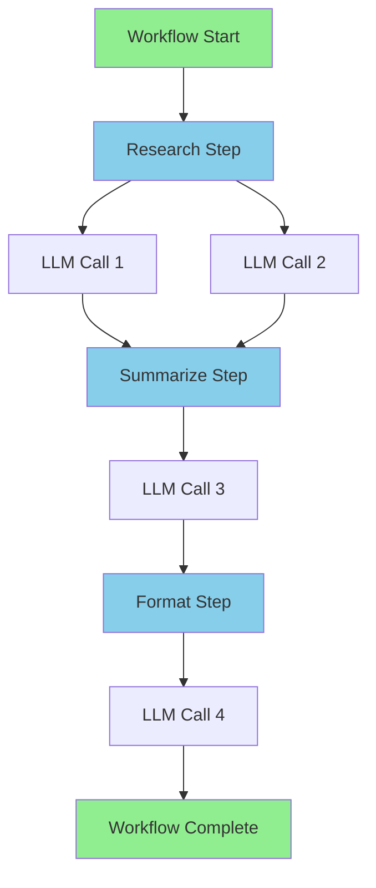

# AGK Trace - Observability & Debugging

The `agk trace` command provides comprehensive observability into your AI workflows, helping you understand execution flow, debug issues, and analyze performance.

## Table of Contents

- [Overview](#overview)
- [Quick Start](#quick-start)
- [Capturing Traces](#capturing-traces)
- [Viewing Traces](#viewing-traces)
- [Trace Commands](#trace-commands)
- [Trace Levels](#trace-levels)
- [Understanding Spans](#understanding-spans)
- [Debugging Workflows](#debugging-workflows)
- [Best Practices](#best-practices)

---

## Overview

Traces capture the complete execution history of your workflows, including:
- ⏱️ **Timing**: Duration of each step and operation
- 🔗 **Flow**: Parent-child relationships between operations
- 📝 **Content**: Prompts sent to LLMs and their responses
- 🛠️ **Tools**: Function calls and their results
- ❌ **Errors**: Detailed error information and stack traces
- 📊 **Metadata**: Context, configuration, and custom attributes

### Architecture

```
┌──────────────────┐
│   Your Workflow  │
│   (with tracing) │
└────────┬─────────┘
         │
         ▼
┌──────────────────┐
│  Trace Collector │
│  (OpenTelemetry) │
└────────┬─────────┘
         │
         ▼
┌──────────────────┐
│   Trace Storage  │
│   (.agk/runs/)   │
└────────┬─────────┘
         │
         ▼
┌──────────────────┐
│   AGK Trace CLI  │
│   (Analysis)     │
└──────────────────┘
```

---

## Quick Start

### 1. Enable Tracing

```bash
# Enable tracing with detailed level
export AGK_TRACE=true
export AGK_TRACE_LEVEL=detailed

# Run your workflow
go run main.go
```

### 2. View Traces

```bash
# List all traces
agk trace list

# Show specific trace summary
agk trace show run-20260207-123456-12345678

# Interactive viewer (TUI)
agk trace view

# Generate flowchart
agk trace mermaid run-20260207-123456-12345678 > flow.md
```

---

## Capturing Traces

### Environment Variables

| Variable | Values | Description |
|----------|--------|-------------|
| `AGK_TRACE` | `true`, `false` | Enable/disable tracing |
| `AGK_TRACE_LEVEL` | `minimal`, `standard`, `detailed` | Data granularity |
| `AGK_TRACE_EXPORTER` | `file`, `stdout` | Output destination |
| `AGK_TRACE_DIR` | path | Trace storage directory (default: `.agk/runs`) |

### Trace Levels

#### Minimal
**Data Captured:**
- Start/end timestamps
- Duration
- Success/failure status
- High-level step names

**Use Case:**
- Production monitoring
- Performance metrics
- Minimal overhead

**Example:**
```bash
export AGK_TRACE=true
export AGK_TRACE_LEVEL=minimal
go run main.go
```

**Output:**
```
Span: workflow_execution
  Duration: 45.2s
  Status: OK
  
Span: research_step
  Duration: 20.1s
  Status: OK
```

---

#### Standard (Default)
**Data Captured:**
- Everything in Minimal
- Token counts
- Model names
- Latency metrics
- Error messages

**Use Case:**
- Development debugging
- Performance analysis
- Cost tracking

**Example:**
```bash
export AGK_TRACE=true
export AGK_TRACE_LEVEL=standard  # or omit (default)
go run main.go
```

**Output:**
```
Span: llm_call
  Duration: 2.3s
  Model: llama3.2
  Tokens: 450 input, 1200 output
  Status: OK
```

---

#### Detailed
**Data Captured:**
- Everything in Standard
- Complete prompts (system + user)
- Full LLM responses
- Tool call arguments
- Tool call results
- Memory state changes

**Use Case:**
- Deep debugging
- Prompt engineering
- Quality evaluation
- Audit trails

**Example:**
```bash
export AGK_TRACE=true
export AGK_TRACE_LEVEL=detailed
go run main.go
```

**Output:**
```
Span: llm_call
  Duration: 2.3s
  Model: llama3.2
  
  Prompt:
    System: You are a helpful research assistant...
    User: Research artificial intelligence trends
  
  Response:
    Artificial intelligence is rapidly evolving...
    [Full response text]
  
  Tokens: 450 input, 1200 output
```

---

## Viewing Traces

### List Traces

Show all captured traces:

```bash
agk trace list
```

**Output:**
```
Available Traces:
─────────────────────────────────────────────────
run-20260207-150034-71394771  | 2026-02-07 15:00:34 | 183.75s | ✓ Success
run-20260207-144512-82934521  | 2026-02-07 14:45:12 | 92.34s  | ✗ Failed
run-20260207-143022-19283746  | 2026-02-07 14:30:22 | 156.21s | ✓ Success
```

### Show Trace Summary

Display high-level summary of a specific trace:

```bash
agk trace show run-20260207-150034-71394771
```

**Output:**
```
Trace: run-20260207-150034-71394771
─────────────────────────────────────────────────
Status:     Success
Duration:   183.75s
Started:    2026-02-07 15:00:34
Workflow:   story

Execution Flow:
├─ workflow_start (0ms)
├─ research_step (65.2s)
│  ├─ llm_call (2.3s)
│  └─ llm_call (1.8s)
├─ summarize_step (58.1s)
│  └─ llm_call (3.1s)
└─ format_step (60.4s)
   └─ llm_call (2.9s)

Total LLM Calls: 4
Total Tokens: 3,245 input, 8,912 output
```

### Interactive Viewer (TUI)

Launch an interactive terminal UI for exploring traces:

```bash
agk trace view
```

**Features:**
- 📋 Browse all traces
- 🔍 Drill down into spans
- 📝 View full prompts and responses (press `d`)
- ⌨️ Keyboard navigation
- 🎨 Syntax highlighting

**Keyboard Shortcuts:**
| Key | Action |
|-----|--------|
| `↑/↓` | Navigate spans |
| `→` | Expand span |
| `←` | Collapse span |
| `d` | Show detailed view (prompts/responses) |
| `q` | Quit |
| `/` | Search |
| `f` | Filter by status |

---

### Generate Flowchart

Create a Mermaid flowchart visualization:

```bash
agk trace mermaid run-20260207-150034-71394771 > flow.md
```

**Output (flow.md):**
````markdown

````

**View in:**
- GitHub (renders automatically)
- VS Code (Mermaid preview extension)
- [Mermaid Live Editor](https://mermaid.live)

---

## Trace Commands

### `agk trace list`

List all captured traces.

**Usage:**
```bash
agk trace list
agk trace list --limit 20
agk trace list --failed  # Show only failed traces
```

**Options:**
| Flag | Description | Default |
|------|-------------|---------|
| `--limit` | Max traces to show | `50` |
| `--failed` | Show only failed traces | `false` |
| `--success` | Show only successful traces | `false` |

---

### `agk trace show <trace-id>`

Display summary of a specific trace.

**Usage:**
```bash
agk trace show run-20260207-150034-71394771
agk trace show run-20260207-150034-71394771 --json
```

**Options:**
| Flag | Description |
|------|-------------|
| `--json` | Output as JSON |
| `--spans` | Show all spans (not just summary) |

---

### `agk trace view`

Launch interactive trace viewer.

**Usage:**
```bash
agk trace view
agk trace view run-20260207-150034-71394771  # Jump to specific trace
```

---

### `agk trace mermaid <trace-id>`

Generate Mermaid flowchart.

**Usage:**
```bash
agk trace mermaid run-20260207-150034-71394771
agk trace mermaid run-20260207-150034-71394771 > flow.md
```

**Options:**
| Flag | Description |
|------|-------------|
| `--style` | Diagram style: `graph`, `sequence` |
| `--depth` | Max depth to visualize |

---

## Understanding Spans

Spans represent individual operations in a trace. Each span has:

### Span Structure

```json
{
  "span_id": "abc123",
  "trace_id": "run-20260207-150034-71394771",
  "parent_id": "xyz789",
  "name": "llm_call",
  "start_time": "2026-02-07T15:00:34.123Z",
  "end_time": "2026-02-07T15:00:36.456Z",
  "duration_ms": 2333,
  "status": "OK",
  "attributes": {
    "model": "llama3.2",
    "provider": "ollama",
    "temperature": 0.7
  },
  "events": [
    {
      "name": "prompt_sent",
      "timestamp": "2026-02-07T15:00:34.124Z",
      "attributes": {
        "prompt": "You are a helpful assistant..."
      }
    },
    {
      "name": "response_received",
      "timestamp": "2026-02-07T15:00:36.455Z",
      "attributes": {
        "response": "Here is the information..."
      }
    }
  ]
}
```

### Common Span Types

| Span Name | Description | Key Attributes |
|-----------|-------------|----------------|
| `workflow_execution` | Top-level workflow | `workflow_name` |
| `agent_step` | Individual agent step | `step_name`, `agent_name` |
| `llm_call` | LLM API call | `model`, `provider`, `tokens` |
| `tool_call` | Function/tool execution | `tool_name`, `arguments` |
| `memory_operation` | Memory read/write | `operation`, `key` |
| `stream_chunk` | Streaming token | `chunk_type`, `content` |

### Span Hierarchy

```
workflow_execution (root)
├─ agent_step: research
│  ├─ llm_call
│  │  ├─ prompt_sent (event)
│  │  └─ response_received (event)
│  └─ tool_call: search
│     ├─ tool_start (event)
│     └─ tool_complete (event)
├─ agent_step: summarize
│  └─ llm_call
└─ agent_step: format
   └─ llm_call
```

---

## Debugging Workflows

### Scenario 1: Slow Performance

**Symptom:** Workflow takes too long to complete

**Debug Steps:**

1. **Enable standard tracing:**
   ```bash
   export AGK_TRACE=true
   export AGK_TRACE_LEVEL=standard
   go run main.go
   ```

2. **View trace summary:**
   ```bash
   agk trace show <trace-id>
   ```

3. **Identify bottleneck:**
   ```
   ├─ research_step (65.2s)  ← Slow!
   ├─ summarize_step (2.1s)
   └─ format_step (1.8s)
   ```

4. **Drill into slow step:**
   ```bash
   agk trace view <trace-id>
   # Press 'd' on research_step to see details
   ```

5. **Optimize:**
   - Reduce LLM `max_tokens`
   - Use faster model
   - Parallelize operations
   - Cache results

---

### Scenario 2: Unexpected Output

**Symptom:** Workflow produces incorrect or unexpected results

**Debug Steps:**

1. **Enable detailed tracing:**
   ```bash
   export AGK_TRACE=true
   export AGK_TRACE_LEVEL=detailed
   go run main.go
   ```

2. **View prompts and responses:**
   ```bash
   agk trace view <trace-id>
   # Press 'd' on llm_call spans
   ```

3. **Check prompts:**
   - Is the system prompt correct?
   - Is context being passed properly?
   - Are variables interpolated correctly?

4. **Analyze responses:**
   - Is the LLM understanding the task?
   - Are instructions clear?
   - Is output format correct?

5. **Fix issues:**
   - Refine prompts
   - Add examples
   - Adjust temperature
   - Change model

---

### Scenario 3: Workflow Failure

**Symptom:** Workflow crashes or returns errors

**Debug Steps:**

1. **List failed traces:**
   ```bash
   agk trace list --failed
   ```

2. **Show error details:**
   ```bash
   agk trace show <failed-trace-id>
   ```

3. **Check error spans:**
   ```
   └─ llm_call (FAILED)
      Error: connection timeout after 30s
   ```

4. **View full trace:**
   ```bash
   agk trace view <failed-trace-id>
   # Navigate to failed span, press 'd'
   ```

5. **Common issues:**
   - Network timeouts → Increase timeout
   - Rate limits → Add retry logic
   - Invalid prompts → Validate input
   - Model errors → Check model availability

---

### Scenario 4: Token Usage

**Symptom:** High costs or slow responses

**Debug Steps:**

1. **Enable standard tracing:**
   ```bash
   export AGK_TRACE=true
   export AGK_TRACE_LEVEL=standard
   go run main.go
   ```

2. **View token summary:**
   ```bash
   agk trace show <trace-id>
   ```
   
   ```
   Total Tokens: 3,245 input, 8,912 output
   ```

3. **Identify high-token operations:**
   ```bash
   agk trace view <trace-id>
   # Sort by tokens
   ```

4. **Optimize:**
   - Reduce `max_tokens`
   - Shorten prompts
   - Use cheaper models for simple tasks
   - Cache responses

---

## Best Practices

### Development

```bash
# Use detailed tracing during development
export AGK_TRACE=true
export AGK_TRACE_LEVEL=detailed
export AGK_TRACE_EXPORTER=file
```

### Testing

```bash
# Standard level for tests
export AGK_TRACE=true
export AGK_TRACE_LEVEL=standard
export AGK_TRACE_DIR=.agk/test-traces
```

### Production

```bash
# Minimal level for production
export AGK_TRACE=true
export AGK_TRACE_LEVEL=minimal
export AGK_TRACE_EXPORTER=file

# Or disable tracing entirely
export AGK_TRACE=false
```

### CI/CD

```yaml
# .github/workflows/test.yml
- name: Run Tests with Tracing
  env:
    AGK_TRACE: true
    AGK_TRACE_LEVEL: standard
  run: go test ./...

- name: Archive Traces
  uses: actions/upload-artifact@v3
  with:
    name: traces
    path: .agk/runs/
```

### Trace Retention

```bash
# Clean old traces (keep last 30 days)
find .agk/runs -type d -mtime +30 -exec rm -rf {} \;

# Archive important traces
tar -czf traces-$(date +%Y%m%d).tar.gz .agk/runs/
```

### Performance Impact

| Level | Overhead | Use Case |
|-------|----------|----------|
| Minimal | ~1-2% | Production |
| Standard | ~2-5% | Development |
| Detailed | ~5-10% | Debugging |

**Tip:** Disable tracing in latency-critical production environments or use minimal level.

---

## Integration with Eval

Traces integrate seamlessly with the eval framework:

```yaml
# semantic-tests.yaml
evalserver:
  url: "http://localhost:8787"
  workflow_name: "story"

# After running tests
agk eval semantic-tests.yaml
```

**Test report includes trace links:**
```markdown
**Trace ID:** [run-20260207-150034-71394771](.agk/runs/run-20260207-150034-71394771/)
```

**View test execution trace:**
```bash
agk trace show run-20260207-150034-71394771
```

---

## Troubleshooting

### No Traces Captured

**Problem:** `AGK_TRACE=true` but no traces in `.agk/runs/`

**Solutions:**
1. Check environment variable:
   ```bash
   echo $AGK_TRACE
   ```
   
2. Verify trace directory exists:
   ```bash
   ls -la .agk/runs/
   ```
   
3. Check file permissions:
   ```bash
   chmod -R 755 .agk/
   ```

4. Try stdout exporter:
   ```bash
   export AGK_TRACE_EXPORTER=stdout
   ```

---

### Large Trace Files

**Problem:** Trace files consuming too much disk space

**Solutions:**
1. Lower trace level:
   ```bash
   export AGK_TRACE_LEVEL=standard  # or minimal
   ```

2. Clean old traces:
   ```bash
   find .agk/runs -mtime +7 -delete
   ```

3. Compress traces:
   ```bash
   tar -czf traces.tar.gz .agk/runs/
   rm -rf .agk/runs/*
   ```

---

### Sensitive Data in Traces

**Problem:** Prompts contain API keys or secrets

**Solutions:**
1. Use environment variables (not hardcoded secrets)
2. Filter sensitive data before tracing
3. Use minimal trace level in production
4. Secure trace storage with proper permissions:
   ```bash
   chmod 700 .agk/runs/
   ```

---

## See Also

- [Eval Documentation](eval.md) - Automated testing
- [AGK CLI Reference](../README.md) - Full command reference
- [OpenTelemetry](https://opentelemetry.io/) - Tracing standard
